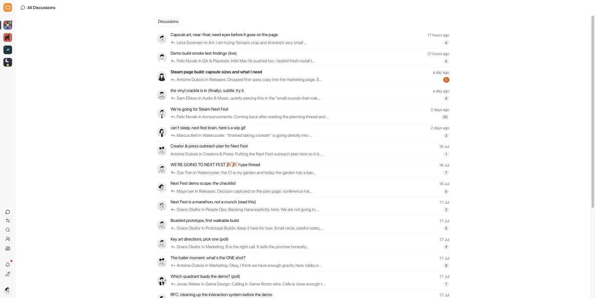

# MGCA — Make Gameplan Chaotic Again

Browser extension (Chrome + Firefox, Manifest V3) that adds an **All Discussions** view to [Gameplan](https://github.com/frappe/gameplan): an extra icon in the community rail opens a full-width panel listing every discussion you can access, across all communities and spaces.



Plain JS/CSS, no build step.

## Install

**Chrome / Edge / Brave / Arc** — `chrome://extensions` → Developer mode → **Load unpacked** → this directory. (A warning about `background.scripts` is expected; that key is for Firefox.)

**Firefox** — `about:debugging#/runtime/this-firefox` → **Load Temporary Add-on** → `manifest.json`. (A warning about `service_worker` is expected; that key is for Chrome.)

Then open your Gameplan tab, **click the toolbar icon**, and allow site access when prompted — the **All Discussions** button appears at the bottom of the community rail, and the site stays activated on every future page load until you remove access (options page, or the browser's site-access settings). If the page has no Gameplan UI the permission is released again and the icon briefly shows ✕.

## Use

- Click the injected icon to open the panel. Newest activity first; **Load more** pages by 20.
- Click a discussion to open it. Going back — breadcrumb, mobile back button, or browser back — returns you to the panel with rows and scroll position restored.
- Dismiss with `Escape`, any native rail icon, or the injected icon again.

## How it works

No static content scripts: a toolbar click requests the site permission (synchronously, inside the click gesture — required for a permanent grant), then probes the tab via `activeTab`; on a non-Gameplan page the permission is released again. Every granted origin has the content script registered, so allowed sites auto-activate on page load until access is removed. The script self-verifies the page is a Gameplan frontend, then injects into the rail (a `MutationObserver` keeps it alive across SPA navigations). Discussions come from the whitelisted `get_discussions` endpoint with no `team`/`project` filter — server-side permission filtering still applies — using your existing session cookie. The panel is styled with Gameplan's own CSS tokens, so light/dark theme follows the app.

## Distribute without the stores

`./build.sh` writes sideloadable packages to `dist/`: a Chrome zip (load unpacked, or force-install via enterprise policy) and a Firefox zip. Release Firefox requires signed extensions, so sign through Mozilla's self-distribution channel (signed, never publicly listed):

```sh
UPDATE_BASE_URL=https://your-host.example/mgca \
AMO_JWT_ISSUER=user:xxx AMO_JWT_SECRET=yyy \
./build.sh sign
```

Upload the signed `.xpi` and the generated `dist/updates.json` to `UPDATE_BASE_URL`; users install by opening the `.xpi` URL and get auto-updates from `updates.json`. To ship an update: bump `version` in `manifest.json`, rebuild, sign, re-upload. API keys: <https://addons.mozilla.org/developers/addon/api/key/>. Skip `sign` for Firefox Developer Edition/Nightly/ESR users with `xpinstall.signatures.required = false`.
